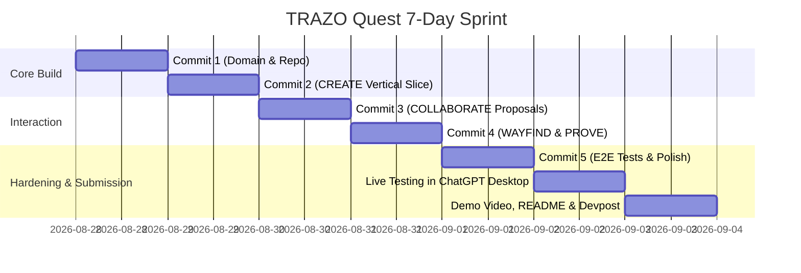

# TRAZO Quest — Implementation Plan V0 (Vertical Execution)

**Target:** OpenAI WebMCP Challenge (7-Day Sprint)  
**Status:** Canonical Plan  
**Gate:** `QUEST_IMPLEMENTATION_PLAN_READY`  
**Base Commit:** `2b5756f` (`docs(quest): define TRAZO Quest and WebMCP collaboration thesis`)  

---

## 1. CURRENT ARCHITECTURE AUDIT & CODEBASE MATRIX

| Subsystem / File | Classification | Exact Role in TRAZO Quest & Technical Scope |
| :--- | :---: | :--- |
| **`src/components/QuestMap.tsx`** | **ADAPT** | Canvas container (`@xyflow/react`). Adapt prop signature to consume dynamic `Quest` instead of static `Chapter`. Add Ghost Node rendering layer and camera panning controller. |
| **`src/components/QuestNode.tsx`** | **ADAPT** | Visual node component. Add `ghost` proposal state rendering (dashed border, muted accent, `[Accept / Reject]` action chips). Keep all existing progress states (`locked`, `available`, `active`, `completed`). |
| **`src/components/QuestEdge.tsx`** | **KEEP** | SVG splines (`smoothSplineThroughVia`, cubic Bezier). Reused as-is for both canonical and ghost edges. |
| **`src/components/CompanionAvatar.tsx`** | **ADAPT** | 2.5D physical sprite, shadow, 8-compass orientation, and Modo TRAZO celebration. Bypass/remove the internal next-action chat popover. |
| **`src/hooks/useCompanionTraveler.ts`** | **KEEP** | 60/120 FPS rAF GPU kinematics along SVG splines with zero React re-renders. |
| **`src/utils/companionPathSampler.ts`** | **KEEP** | Mathematical SVG path sampling and tangent angle derivation. |
| **`src/domain/progression.ts`** | **KEEP** | Pure mathematical progression derivation (`deriveMissionProgress`, `deriveEdgeProgress`). Completely agnostic of courses or coaches. |
| **`src/domain/evaluationPolicy.ts`** | **ADAPT** | Fail-closed deterministic policy engine ($0.70$ confidence gate). Adapt to support `EvaluationContract` types (`deterministic`, `rubric`, `hybrid`). |
| **`src/domain/methodologyValidation.ts`** | **KEEP** | Cycle detection, topological sorting, and prerequisite integrity validation. Reused to validate dynamic `Quest` graphs. |
| **`src/server/ai/runtime.ts`** | **KEEP** | Canonical Vertex AI / Gemini 3.7 Flash client runtime with ADC and retry backoffs. |
| **`src/server/repository.ts`** | **ADAPT** | Introduce `IQuestRepository` with `FileStorageQuestRepository` and `FirestoreQuestRepository` storing dynamic `Quest` documents and optimistic `version` counters. |
| **`src/server/service.ts`** | **ADAPT** | Adapt `ImplementationService` into `QuestService`, replacing static `resolvePack` lookups with dynamic `QuestRepository` state. |
| **`src/data/course.ts` & `packs/`** | **BYPASS** | Static course packs are bypassed in Quest runtime. Kept as offline test seeds. |
| **`RoleGateway`, `CoachIntro`, `CalibrationView`** | **REMOVE_FROM_QUEST_RUNTIME** | Bypass multi-role gateways and creator calibration screens. |
| **`src/server/autonomy/`** | **DEFER** | Autonomous nudge scheduler is deferred; real-time external agent interactions supersede background crons. |

---

## 2. CORE DOMAIN INVARIANTS

The implementation must enforce these eight non-negotiable invariants:

* **INVARIANT 1 (Collaborative Proposal Authority):** External agents may suggest or create path structure through authorized WebMCP tools, but have no power to bypass validation.
* **INVARIANT 2 (Zero Completion Authority):** External agents have **ZERO direct authority** to mark missions complete or force state transitions.
* **INVARIANT 3 (Deterministic Consequential Progression):** Only evidence evaluation followed by deterministic policy (`evaluationPolicy.ts`) may mutate authoritative completion and unlock downstream nodes.
* **INVARIANT 4 (Pre-Sealed Contracts):** Every authoritative mission must have an `EvaluationContract` defined and sealed *before* evidence evaluation begins.
* **INVARIANT 5 (Anti-Cheating Immutability):** Evaluation criteria cannot be softened or mutated after seeing the user's evidence in order to manufacture a false `PASS`.
* **INVARIANT 6 (DAG Mathematical Integrity):** Every graph mutation (creation or proposal acceptance) must preserve acyclicity and valid prerequisite references.
* **INVARIANT 7 (Single Persistent Source of Truth):** Human and agent operate on the same persistent Quest document across reloads.
* **INVARIANT 8 (Optimistic Concurrency & Stale Write Protection):** Graph mutations must validate `expectedVersion`. Stale agent writes cannot silently overwrite newer human modifications.

---

## 3. MINIMAL DOMAIN MODEL

Adapt existing domain types (`src/domain/course.ts`) into a lean, dynamic structure:

```typescript
// ─── EVALUATION CONTRACT ───────────────────────────────────────────────────
export type EvaluationContractType = 'deterministic' | 'rubric' | 'hybrid';

export interface DeterministicRule {
  type: 'regex' | 'json_schema' | 'numeric_range' | 'contains_all';
  pattern?: string;
  field?: string;
  min?: number;
  max?: number;
  failureMessage: string;
}

export interface RubricCriterion {
  id: string;
  label: string;
  description: string;
  isRequired: boolean;
}

export interface EvaluationContract {
  type: EvaluationContractType;
  description: string;
  deterministicRules?: DeterministicRule[];
  rubricCriteria?: RubricCriterion[];
  confidenceThreshold?: number; // default 0.70
}

// ─── QUEST TOPOLOGY & NODES ────────────────────────────────────────────────
export interface QuestMission {
  id: string;
  title: string;
  description: string;
  nodeType: 'normal' | 'optional' | 'milestone';
  mapRole?: 'entry' | 'convergence';
  position: { x: number; y: number };
  prerequisites: string[];
  evidencePrompt: string;
  evaluationContract: EvaluationContract;
  producesArtifacts?: string[];
  consumesArtifacts?: string[];
}

export interface QuestEdge {
  id: string;
  source: string;
  target: string;
  optional?: boolean;
}

// ─── GHOST PROPOSALS ───────────────────────────────────────────────────────
export type ProposalStatus = 'pending' | 'accepted' | 'rejected';

export interface QuestProposal {
  id: string;
  questId: string;
  targetExpectedVersion: number;
  mission: QuestMission;
  connectFrom: string[];
  connectTo?: string[];
  status: ProposalStatus;
  createdAt: string;
}

// ─── QUEST ENTITY & PROGRESSION ────────────────────────────────────────────
export interface Quest {
  id: string;
  version: number;
  goal: {
    rawPrompt: string;
    targetOutcome: string;
  };
  entryNodeIds: string[];
  missions: QuestMission[];
  edges: QuestEdge[];
  proposals: QuestProposal[];
  createdAt: string;
  updatedAt: string;
}

export interface QuestProgress {
  questId: string;
  completedMissionIds: string[];
  activeMissionId?: string;
  artifacts: Record<string, { key: string; sourceMissionId: string; value: unknown; createdAt: string }>;
  updatedAt: string;
}
```

* *Design Decision on Contract Types:* Support `deterministic`, `rubric`, and `hybrid` for MVP. `artifact` and `external_proof` remain schema-ready extensions, minimizing unneeded surface for the 7-day sprint.

---

## 4. FINAL WEBMCP TOOL SURFACE V0

Expose exactly **five high-leverage tools** in the browser page via `document.modelContext`:

```
┌────────────────────────────────────────────────────────────────────────┐
│                        WEBMCP TOOL SURFACE V0                          │
├──────────────────────────┬──────────┬──────────────────────────────────┤
│ Tool Name                │ Access   │ Purpose                          │
├──────────────────────────┼──────────┼──────────────────────────────────┤
│ `create_quest`           │ Mutating │ Initializes Quest DAG from goal  │
│ `get_quest_state`        │ ReadOnly │ Returns topology & progress      │
│ `propose_quest_change`   │ Mutating │ Injects reviewable Ghost Node    │
│ `focus_mission`          │ ReadOnly │ Pans camera & moves 2.5D mascot  │
│ `submit_evidence`        │ Mutating │ Evaluates evidence via Judge     │
└──────────────────────────┴──────────┴──────────────────────────────────┘
```

### 1. `create_quest`
* **Description:** Initializes a new structured Quest graph from the user's learning or implementation goal.
* **Input Schema:**
  ```json
  {
    "type": "object",
    "properties": {
      "goalPrompt": { "type": "string" },
      "targetOutcome": { "type": "string" },
      "missions": {
        "type": "array",
        "items": {
          "type": "object",
          "properties": {
            "id": { "type": "string" },
            "title": { "type": "string" },
            "description": { "type": "string" },
            "nodeType": { "type": "string", "enum": ["normal", "optional", "milestone"] },
            "mapRole": { "type": "string", "enum": ["entry", "convergence"] },
            "prerequisites": { "type": "array", "items": { "type": "string" } },
            "evidencePrompt": { "type": "string" },
            "evaluationContract": {
              "type": "object",
              "properties": {
                "type": { "type": "string", "enum": ["deterministic", "rubric", "hybrid"] },
                "description": { "type": "string" }
              },
              "required": ["type", "description"]
            }
          },
          "required": ["id", "title", "description", "prerequisites", "evidencePrompt", "evaluationContract"]
        }
      },
      "edges": {
        "type": "array",
        "items": {
          "type": "object",
          "properties": {
            "source": { "type": "string" },
            "target": { "type": "string" },
            "optional": { "type": "boolean" }
          },
          "required": ["source", "target"]
        }
      }
    },
    "required": ["goalPrompt", "targetOutcome", "missions", "edges"]
  }
  ```
* **Output:** `{ "questId": string, "version": number, "totalMissions": number, "activeMissionId": string }`
* **Annotations:** `readOnlyHint: false`

---

### 2. `get_quest_state`
* **Description:** Returns the active quest topology, unlocked nodes, active mission, and completed status.
* **Input Schema:** `{ "type": "object", "properties": { "questId": { "type": "string" } }, "required": ["questId"] }`
* **Output:** `{ "quest": Quest, "progress": QuestProgress, "availableMissionIds": string[] }`
* **Annotations:** `readOnlyHint: true`

---

### 3. `propose_quest_change`
* **Description:** Proposes adding a new mission or detour node into the active quest map for human approval.
* **Input Schema:**
  ```json
  {
    "type": "object",
    "properties": {
      "questId": { "type": "string" },
      "expectedVersion": { "type": "integer" },
      "mission": { "type": "object", "description": "Full QuestMission definition" },
      "connectFrom": { "type": "array", "items": { "type": "string" } },
      "connectTo": { "type": "array", "items": { "type": "string" } }
    },
    "required": ["questId", "expectedVersion", "mission", "connectFrom"]
  }
  ```
* **Output:** `{ "proposalId": string, "status": "pending", "renderedGhostNodeId": string }`
* **Annotations:** `readOnlyHint: false`

---

### 4. `focus_mission`
* **Description:** Pans the canvas camera to focus on a specific mission and navigates the 2.5D companion to it.
* **Input Schema:** `{ "type": "object", "properties": { "missionId": { "type": "string" } }, "required": ["missionId"] }`
* **Output:** `{ "focused": true, "missionId": string, "status": string }`
* **Annotations:** `readOnlyHint: true`

---

### 5. `submit_evidence`
* **Description:** Submits student evidence for evaluation against the sealed EvaluationContract.
* **Input Schema:**
  ```json
  {
    "type": "object",
    "properties": {
      "questId": { "type": "string" },
      "missionId": { "type": "string" },
      "evidenceText": { "type": "string" }
    },
    "required": ["questId", "missionId", "evidenceText"]
  }
  ```
* **Output:**
  ```json
  {
    "verdict": "PASS" | "REWORK" | "CLARIFY",
    "feedback": string,
    "completed": boolean,
    "unlockedMissionIds": string[]
  }
  ```
* **Annotations:** `readOnlyHint: false`, `untrustedContentHint: true`

---

## 5. INTERACTION FLOWS & ARCHITECTURE

### Flow 1: CREATE (First Vertical Slice)
1. Human enters learning goal in ChatGPT.
2. ChatGPT invokes `create_quest(goalPrompt, targetOutcome, missions, edges)`.
3. WebMCP handler dispatches payload to backend `POST /api/v1/quests`.
4. Backend runs `validateMethodologyGraph()`, computes layout coordinates if missing, saves Quest (v1) and initializes `QuestProgress`.
5. Client React store updates immediately; `QuestMap.tsx` renders the DAG without page reload.
6. Returns `{ questId: "qst_123", version: 1, activeMissionId: "M01" }` to ChatGPT.

---

### Flow 2: COLLABORATE (Ghost Node Proposal)
1. Agent proposes detour via `propose_quest_change(questId, expectedVersion: 1, mission, connectFrom: ["M01"])`.
2. Backend creates a `QuestProposal` entity (`status: "pending"`); does **not** alter canonical DAG edges.
3. Client renders the proposed node with a dashed border, muted indigo styling, and `[Accept / Reject]` chips.
4. When human clicks `[Accept]`:
   * Client sends `POST /api/v1/quests/:id/proposals/:proposalId/accept`.
   * Backend checks `quest.version === targetExpectedVersion`.
   * Backend appends mission to `quest.missions`, links edges, bumps `quest.version` to 2, and saves.
   * Node transitions from ghost state to canonical `available` or `locked` state on canvas.
5. If human clicks `[Reject]`: Proposal is purged; zero state corruption.

---

### Flow 3: WAYFIND (Camera & Companion Movement)
1. Agent calls `focus_mission({ missionId: "M02" })`.
2. WebMCP callback dispatches a UI action (pure client-side state mutation; zero backend write).
3. React Flow camera invokes `fitBounds` / `setCenter` targeting M02 coordinates with smooth easing.
4. `useCompanionTraveler.ts` samples spline path to M02 and animates the 2.5D mascot to M02 rest coordinates.
5. UI opens `MissionPanel` drawer displaying M02 requirements.

---

### Flow 4: PROVE (Evidence Submission & Deterministic Unlock)
1. Human submits evidence text via `MissionPanel` (or agent invokes `submit_evidence`).
2. Backend validates mission is not `locked` and retrieves sealed `EvaluationContract`.
3. **Stage 1 (Deterministic Check):** If contract has `deterministicRules`, executes regex/numeric bounds. If failed $\rightarrow$ returns `REWORK` immediately (zero LLM inference cost).
4. **Stage 2 (Semantic Judge):** If deterministic rules pass, dispatches prompt to Gemini 3.7 Flash runtime.
5. Backend runs strict schema validation and evaluates `evaluationPolicy.ts`.
6. If `PASS`:
   * Appends missionId to `completedMissionIds`.
   * Materializes canonical artifacts (if specified).
   * Persists progress state in Firestore/FileStorage.
   * Triggers Modo TRAZO (mascot celebratory hop + cobalt route illumination).
   * Recomputes `progression.ts` and unlocks downstream nodes.
7. If `REWORK`: Records diagnostic feedback in history; zero progression mutation.

---

## 6. LIGHTWEIGHT OPTIMISTIC CONCURRENCY MODEL

To prevent stale agent overwrites while keeping the system lightweight:
1. Every `Quest` document carries an integer `version` (starts at 1).
2. All mutating operations (`propose_quest_change`, proposal acceptance) submit `expectedVersion`.
3. Backend checks:
   ```typescript
   if (quest.version !== dto.expectedVersion) {
     throw new StaleQuestVersionError(
       `STALE_QUEST_VERSION: expected version ${dto.expectedVersion}, but current version is ${quest.version}`
     );
   }
   quest.version += 1;
   ```
4. If a conflict occurs, the agent is instructed to call `get_quest_state` to refresh context before retrying.

---

## 7. PERSISTENCE STRATEGY

* **Durable JSON FileStorage (Local & Dev):** Uses deep-cloned JSON stores under `.data/quests.json` and `.data/quest-progress.json` with existing quarantine crash protection (`StoreLoadError`).
* **Firestore Implementation (Production / Cloud Run):** Dedicated `quests` and `quest_progress` collections.
* **Zero Migration Overhead:** Avoids migrating old Programs collections; operates as a clean, independent domain collection.

---

## 8. LIVE UI STATE SYNCHRONIZATION

```
[Agent WebMCP Call]
       │
       ▼
[document.modelContext.execute()]
       │
       ▼
[QuestStateStore (Zustand / React Context Store)]
       │
       ├──────────────────────────────────────────┐
       ▼                                          ▼
[Optimistic UI Dispatch]              [Backend HTTP API Call]
• Updates nodes on canvas              • POST /api/v1/quests/...
• Renders Ghost Node instantly         • Backend persists to Firestore
• Pans camera smoothly                 • Returns authoritative confirmation
```

* **Mechanism:** Single client-side `QuestStore` acts as the reactive single source of truth. When WebMCP tools execute, they update `QuestStore` state, triggering immediate React component re-renders on the canvas without full-page reloads.

---

## 9. CONCISE ERROR MODEL

| Error Code | Meaning | Agent Action | Human Action |
| :--- | :--- | :--- | :--- |
| `INVALID_GRAPH` | Graph contains cycles or dangling prerequisites. | Regenerate valid DAG topology. | None. |
| `INVALID_CONTRACT` | EvaluationContract schema is malformed. | Fix contract parameters. | None. |
| `MISSION_NOT_FOUND` | `missionId` does not exist in active Quest. | Call `get_quest_state` to check IDs. | Select visible node. |
| `MISSION_LOCKED` | Attempted submission on locked node. | Advise user on prerequisites. | Complete prior steps. |
| `STALE_QUEST_VERSION` | Version mismatch / race condition. | Call `get_quest_state` and retry. | Refresh view. |
| `EVALUATION_FAILED` | Internal Judge runtime error. | Retry submission. | Retry button. |

---

## 10. HERO DEMO SPECIFICATION: APPLIED ECONOMETRICS (MEXICAN INFLATION)

```
┌────────────────────────────────────────────────────────────────────────┐
│               HERO QUEST GRAPH: MEXICAN INFLATION (INPC)               │
│                                                                        │
│   [M01: Ingest INPC Data]                                              │
│             │                                                          │
│             ▼                                                          │
│   [M02: Stationarity Test (ADF)] ─── (Ghost Proposal) ──► [M02_b: ARCH]│
│             │                                                          │
│             ▼                                                          │
│   [M03: Forecasting Model]                                             │
│             │                                                          │
│             ▼                                                          │
│   [M04: Economic Interpretation]                                       │
└────────────────────────────────────────────────────────────────────────┘
```

* **Mission M02 Contract Specification:**
  ```json
  {
    "type": "hybrid",
    "description": "Validates Dickey-Fuller statistical test consistency and economic unit root reasoning.",
    "deterministicRules": [
      {
        "type": "regex",
        "pattern": "(ADF|Dickey-Fuller|Test Statistic|p-value)",
        "failureMessage": "Evidence must include Dickey-Fuller test output with test statistic and p-value."
      }
    ],
    "rubricCriteria": [
      {
        "id": "c1_unit_root_logic",
        "label": "Correct null hypothesis interpretation",
        "description": "Correctly concludes that p > 0.05 fails to reject unit root, requiring first differences.",
        "isRequired": true
      }
    ]
  }
  ```
* **Repeatable Demo Submissions:**
  * **Test 1 (REWORK):** Submits raw price index level without ADF test $\rightarrow$ Deterministic rule fails $\rightarrow$ Judge returns `REWORK` with feedback: *"Evidence lacks statistical test output"*.
  * **Test 2 (PASS):** Submits ADF test statistic ($-1.42$, $p=0.57$) with explanation $\rightarrow$ Deterministic rule passes $\rightarrow$ Judge confirms logic $\rightarrow$ `PASS` $\rightarrow$ Modo TRAZO activates $\rightarrow$ M03 unlocks.

---

## 11. TEST STRATEGY

* **Domain Unit Tests (`tests/questDomain.test.ts`):**
  * Validates acyclic graph creation and rejects cyclic topologies.
  * Rejects dangling prerequisite IDs.
  * Validates optimistic version check (`STALE_QUEST_VERSION`).
  * Enforces Invariant #5: Non-PASS never unlocks downstream nodes.
* **WebMCP Integration Tests (`tests/webmcpAdapter.test.ts`):**
  * Verifies tool registration and schema fidelity.
  * Verifies tool execution dispatches correct backend mutations.
  * Verifies `AbortSignal` cleanup on unmount.
* **Hero Flow E2E Test (`tests/questHeroFlow.e2e.test.ts`):**
  * Full sequence: `create_quest` $\rightarrow$ `propose_quest_change` $\rightarrow$ `accept` $\rightarrow$ `focus_mission` $\rightarrow$ `submit_evidence` (`REWORK`) $\rightarrow$ `submit_evidence` (`PASS`) $\rightarrow$ verify unlock.

---

## 12. EXACT FIVE IMPLEMENTATION COMMITS

```
fb07257 [pre-webmcp-quest]
  │
  ├─► Commit 1: feat(quest): dynamic Quest domain models, validation, and repository
  │   - Add Quest, QuestMission, QuestEdge, QuestProgress, EvaluationContract to src/domain/quest.ts
  │   - Add IQuestRepository & FileStorageQuestRepository with optimistic versioning
  │   - Unit tests: tests/questDomain.test.ts
  │
  ├─► Commit 2: feat(webmcp): CREATE vertical slice and WebMCP page adapter
  │   - Implement useWebMCPTool React hook with document.modelContext
  │   - Expose create_quest and get_quest_state tools
  │   - Connect React Flow QuestMap to dynamic Quest state
  │   - Integration tests: tests/webmcpCreateSlice.test.ts
  │
  ├─► Commit 3: feat(quest): Ghost Node proposal and human collaboration flow
  │   - Expose propose_quest_change WebMCP tool
  │   - Render Ghost Nodes with dashed borders and [Accept / Reject] action chips
  │   - Implement proposal acceptance API with DAG validation
  │   - Tests: tests/questProposal.test.ts
  │
  ├─► Commit 4: feat(quest): Wayfinding camera sync and evidence-based PROVE loop
  │   - Expose focus_mission (smooth camera pan + companion movement)
  │   - Expose submit_evidence tool connected to EvaluationContract Judge
  │   - Wire Modo TRAZO celebration and deterministic progression unlock
  │   - Tests: tests/questProgression.test.ts
  │
  ├─► Commit 5: test(demo): complete hero flow E2E hardening, polish, and zero-slop audit
  │   - Full E2E test suite: tests/questHeroFlow.e2e.test.ts
  │   - Polish 60-30-10 APCA contrast and responsive layout
  │   - Add comprehensive README with reproduction instructions
```

---

## 13. SEVEN-DAY EXECUTION TIMELINE



---

## 14. KILL SWITCHES & SCOPE DISCIPLINE

* **Kill Switch 1 (Companion Movement):** If SVG spline companion animation creates layout jitter during camera pan $\rightarrow$ *Keep camera pan, drop companion walking animation.*
* **Kill Switch 2 (Remediation Branching):** If dynamic detour branching introduces routing instability $\rightarrow$ *Defer stretch goal; rely strictly on standard REWORK diagnostic feedback.*
* **Kill Switch 3 (Ghost Node Editing):** If in-line node editing in UI adds complex modal state $\rightarrow$ *Support Accept / Reject only.*
* **Kill Switch 4 (WebMCP Helpers):** If external WebMCP helper packages fail to load $\rightarrow$ *Use native direct `document.modelContext.registerTool()` calls.*

---

## 15. DEFINITION OF HACKATHON DONE

TRAZO Quest is **HACKATHON READY** when a judge can:
1. Open the public hosted URL in Chrome (WebMCP enabled) or ChatGPT Desktop.
2. ChatGPT discovers TRAZO Site Tools in the address bar automatically.
3. User gives a learning goal $\rightarrow$ ChatGPT calls `create_quest` $\rightarrow$ Canvas renders dynamic DAG live.
4. User asks for a modification $\rightarrow$ ChatGPT calls `propose_quest_change` $\rightarrow$ Ghost Node appears $\rightarrow$ User clicks `[Accept]`.
5. User asks where to start $\rightarrow$ ChatGPT calls `focus_mission` $\rightarrow$ Canvas pans to M01.
6. User submits flawed evidence $\rightarrow$ Judge returns `REWORK` $\rightarrow$ Map remains locked.
7. User submits valid evidence $\rightarrow$ Judge returns `PASS` $\rightarrow$ Modo TRAZO activates and M02 unlocks.
8. Refreshing the browser page preserves all progress and unlocked states.

---

## 16. FIRST IMPLEMENTATION TASK

```text
TASK: Commit 1 — Dynamic Quest Domain Models, Repository, and Validation

1. Create `src/domain/quest.ts` defining:
   - Quest, QuestGoal, QuestMission, QuestEdge, QuestProgress, EvaluationContract, QuestProposal.
2. Create `src/server/quest/questRepository.ts` with `FileStorageQuestRepository` and in-memory copy-on-write store supporting optimistic concurrency (`version` checks).
3. Adapt `src/domain/methodologyValidation.ts` into `src/domain/questValidation.ts` to validate arbitrary dynamic Quest DAGs.
4. Add unit test suite `tests/questDomain.test.ts` verifying DAG acyclicity, prerequisite integrity, version conflict rejection, and contract serialization.
```

---

## FINAL GATE

```text
QUEST_IMPLEMENTATION_PLAN_READY
```

The V0 implementation plan is fully specified, verified against primary sources, de-risked with explicit kill switches, and structured into five vertical commits. Execution is ready to begin upon user prompt.
